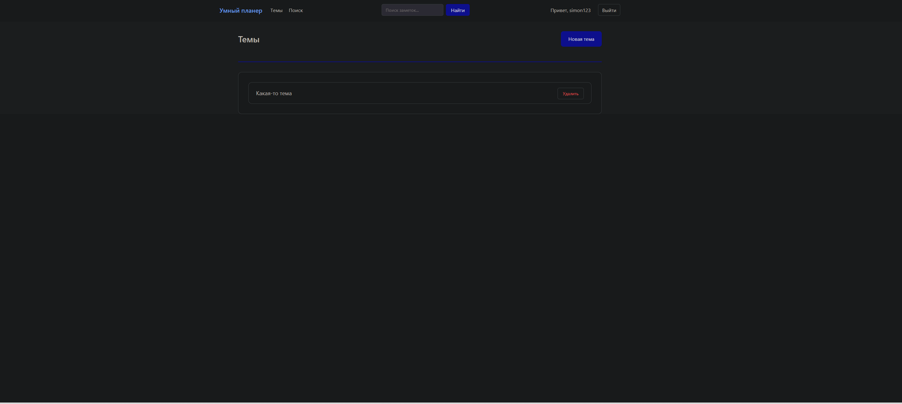
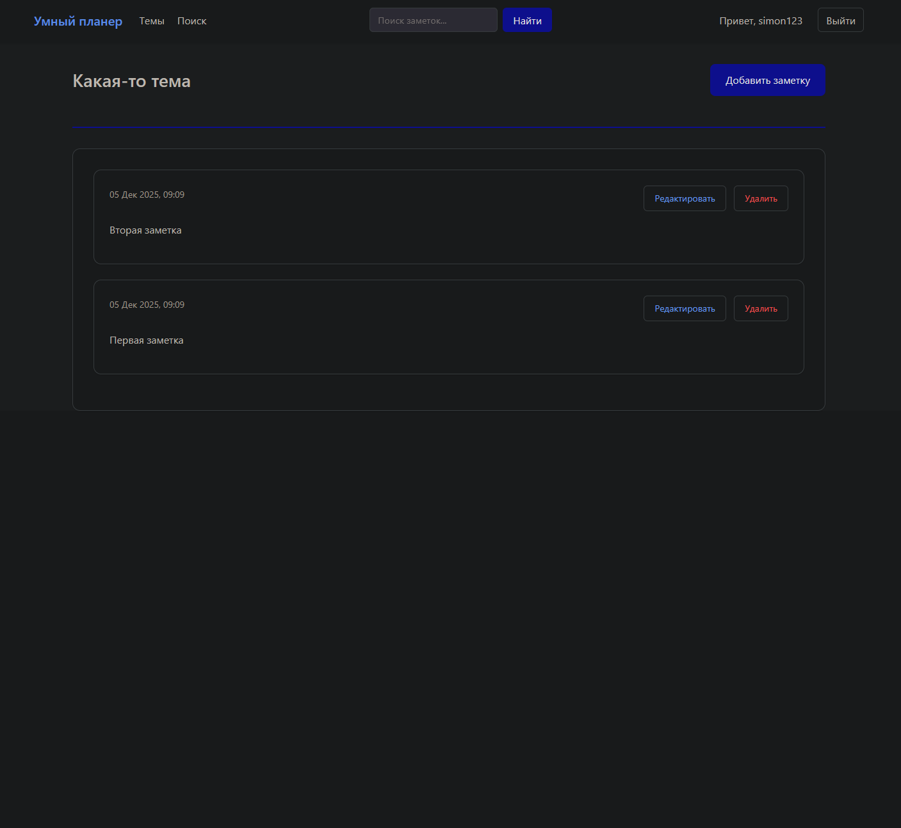
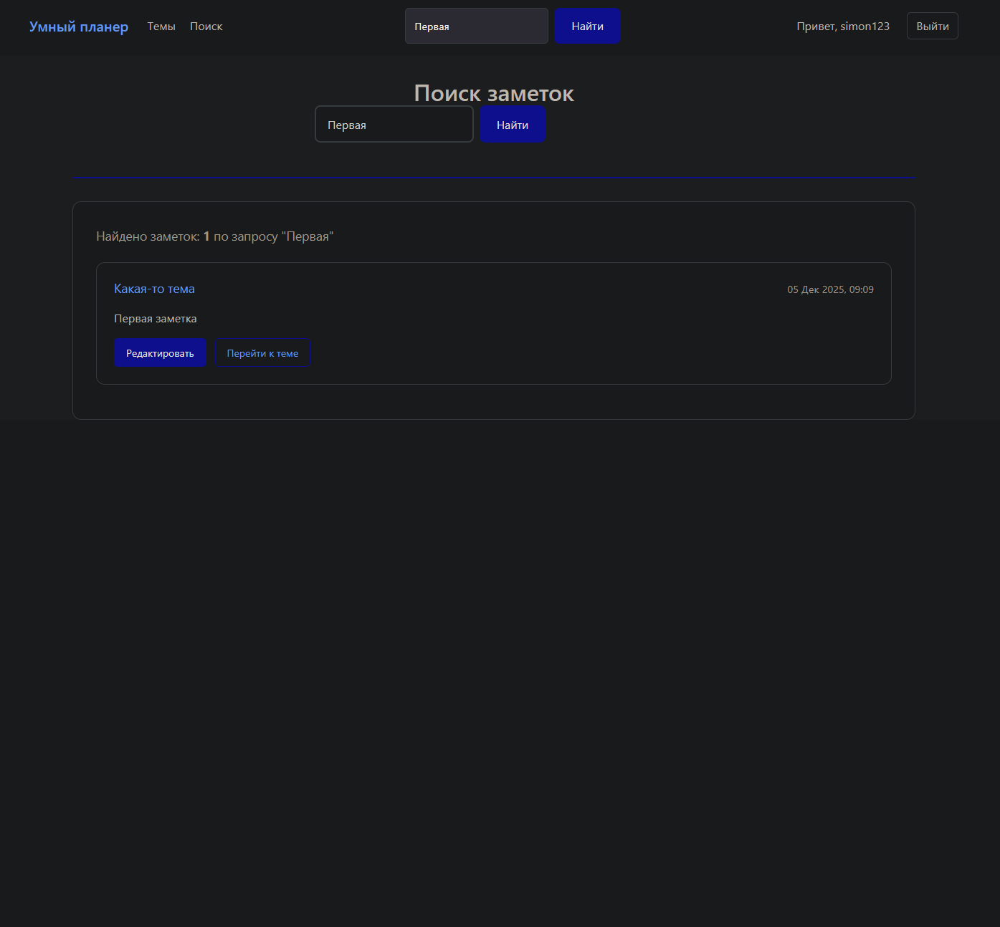

# Smart Planner 

A clean and intuitive web application for organizing notes with smart topic-based navigation.

## Main page:
 
## Topics page:

## Notes page:

## Search page:


## Features
- **Topic-based organization** - Group notes by custom categories
- **Quick search** - Find notes by title or content
- **Simple CRUD** - Create, edit, delete notes easily
- **User authentication** - Secure personal accounts
- **Responsive design** - Works on all devices
- **Clean UI** - Built with Bootstrap 5

## Live Demo
Try it here: [https://web-production-d558d.up.railway.app/]

## Tech Stack
- **Backend**: Django, Python
- **Frontend**: Bootstrap 5, HTML5, CSS
- **Database**: SQLite (dev), PostgreSQL-ready
- **Deployment**: Railway

## Installation

### Prerequisites
- Python 3.8+
- pip

### Steps
```bash
# Clone repository
git clone https://github.com/yourusername/smart_planner.git
cd smart_planner

# Install dependencies
pip install -r requirements.txt

# Setup database
python manage.py migrate

# Create admin user
python manage.py createsuperuser

# Run server
python manage.py runserver
